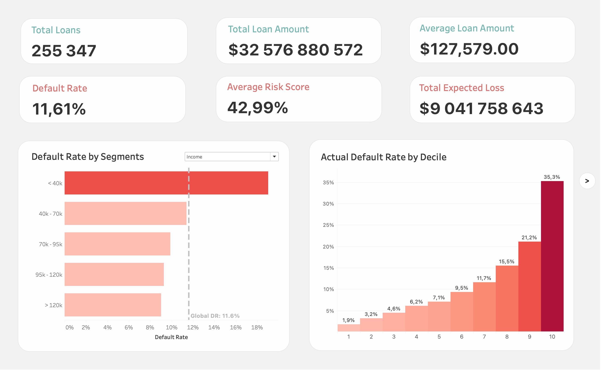
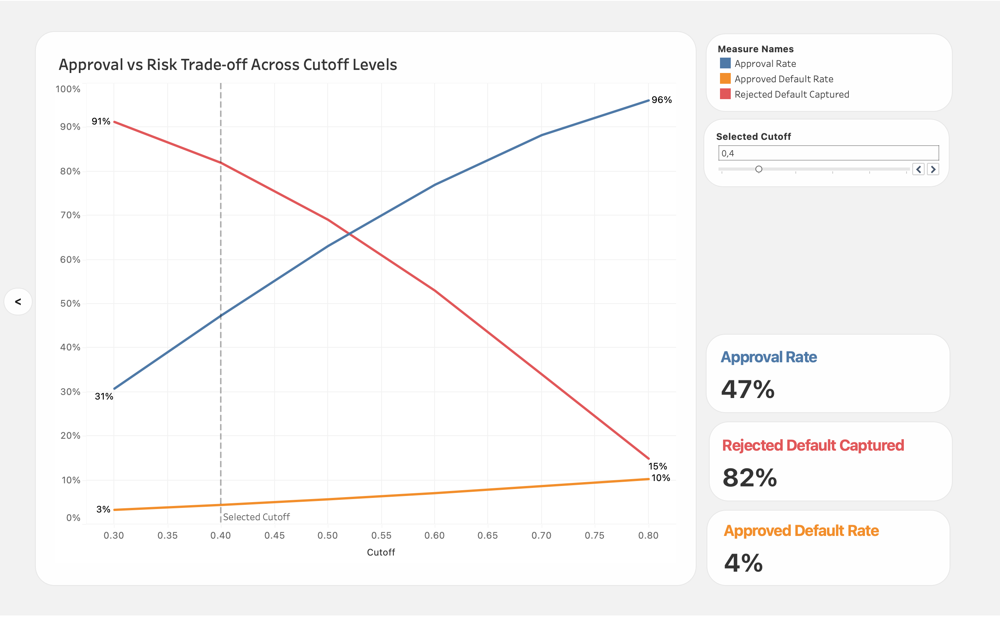

# Loan Default Risk Analysis

[](#completed-work)
[](https://www.python.org/)
[](https://scikit-learn.org/)
[](https://www.mysql.com/)
[](https://public.tableau.com/)

End-to-end credit risk portfolio project using Python, SQL, and Tableau:

- train a Probability of Default (PD) model
- score the full portfolio
- analyze risk behavior with SQL
- visualize portfolio and model insights in Tableau

## Project Workflow

1. **Modeling in Python**
2. **Scoring all loans with saved pipeline**
3. **SQL analytics layer for portfolio and model validation**
4. **Tableau dashboard for final communication**

## Completed Work

### 1) Python Modeling and Scoring

- Logistic Regression PD model in `PD_modeling_updated.ipynb`
- Preprocessing + model bundled in sklearn `Pipeline`
- Fitted artifact saved as `pd_pipeline.joblib`
- Full portfolio scoring in `PD_scoring.ipynb`
- Exported scored data: `data_raw/loan_risk_scores.csv`

### 2) SQL Analytics

SQL scripts:

- `sql/00.joined_view.sql`
- `sql/01.portfolio_overview.sql`
- `sql/02.risk_decile_analysis.sql`
- `sql/03.risk_analysis_by_segments.sql`
- `sql/04.top_expected_loss_loans.sql`
- `sql/05.cutoff_simulation.sql`

Exported analysis outputs for Tableau:

- `data_analytics/portfolio_overview_kpis.csv`
- `data_analytics/risk_decile_overview_new.csv`
- `data_analytics/risk_by_segments_overview.csv`
- `data_analytics/top_expeced_loss_loans.csv`
- `data_analytics/cutoff_simulation.csv`

### 3) Tableau Dashboard

- Workbook: `Loan_default_risk_vizualisation.twb`
- Uses SQL-generated CSV files from `data_analytics/`

## Repository Structure

```text
.
├── PD_modeling_updated.ipynb
├── PD_scoring.ipynb
├── pd_pipeline.joblib
├── sql/
│   ├── 00.joined_view.sql
│   ├── 01.portfolio_overview.sql
│   ├── 02.risk_decile_analysis.sql
│   ├── 03.risk_analysis_by_segments.sql
│   ├── 04.top_expected_loss_loans.sql
│   └── 05.cutoff_simulation.sql
├── data_raw/
│   ├── Loan_default.csv
│   └── loan_risk_scores.csv
├── data_analytics/
│   ├── portfolio_overview_kpis.csv
│   ├── risk_decile_overview_new.csv
│   ├── risk_by_segments_overview.csv
│   ├── top_expeced_loss_loans.csv
│   └── cutoff_simulation.csv
└── Loan_default_risk_vizualisation.twb
```

## Tableau Screenshot




## Tech Stack

### Core Tools

[](https://pandas.pydata.org/)
[](https://numpy.org/)
[](https://scikit-learn.org/)
[](https://www.mysql.com/)
[](https://public.tableau.com/)

### Supporting Libraries

[](https://joblib.readthedocs.io/)
[](https://jupyter.org/)
